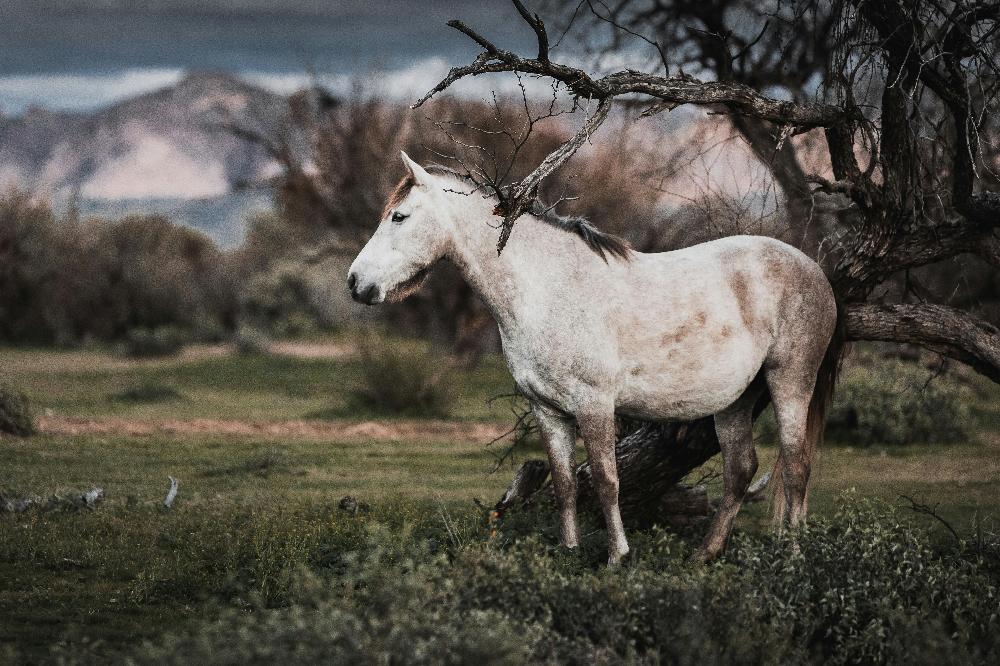

# EXAMPLE
<!DOCTYPE html>
<html lang="en">
<head>
    <meta charset="UTF-8">
    <meta name="viewport" content="width=device-width, initial-scale=1.0">
    <title>Animal Galaxy - Fixed Menu</title>
    <link rel="stylesheet" href="https://cdnjs.cloudflare.com/ajax/libs/font-awesome/6.0.0/css/all.min.css">
    
</head>
<body>

    

    <nav class="side-nav" id="mainMenu">
        
<i class="fas fa-times"></i>

        <h2><i class="fas fa-paw"></i> Explore</h2>
        <a href="#"><i class="fas fa-home"></i> Home</a>
        <a href="#"><i class="fas fa-fire"></i> Trending</a>
        <a href="#"><i class="fas fa-heart"></i> Favorites</a>
    </nav>

    <header>
        
<i class="fas fa-bars"></i>

        

            <i class="fas fa-search"></i>
            <input type="text" id="searchInput" placeholder="Search animals..." onkeyup="filterVideos()">
        

        

    </header>

    

        

            
            

                

                    <video src="myvideo.mp4" loop muted></video>
                    

                        

                        

                            <button class="like-btn"><i class="fas fa-thumbs-up"></i></button>
                            <button class="dislike-btn"><i class="fas fa-thumbs-down"></i></button>
                            <button class="bell-btn"><i class="fas fa-bell"></i></button>
                            <button class="minimize-btn"><i class="fas fa-compress"></i></button>
                        

                    

                

                

                    
                    Cat Animal Video
                

            

            

                

                    <video src="myvedio1.mp4" loop muted></video>
                    

                        

                        

                            <button class="like-btn"><i class="fas fa-thumbs-up"></i></button>
                            <button class="dislike-btn"><i class="fas fa-thumbs-down"></i></button>
                            <button class="bell-btn"><i class="fas fa-bell"></i></button>
                            <button class="minimize-btn"><i class="fas fa-compress"></i></button>
                        

                    

                

                

                    
                    Dog Animal Video
                

            

            

                

                    <video src="myvedio2.mp4" loop muted></video>
                    

                        

                        

                            <button class="like-btn"><i class="fas fa-thumbs-up"></i></button>
                            <button class="dislike-btn"><i class="fas fa-thumbs-down"></i></button>
                            <button class="bell-btn"><i class="fas fa-bell"></i></button>
                            <button class="minimize-btn"><i class="fas fa-compress"></i></button>
                        

                    

                

                

                    
                    Bird Animal Video
                

            

        

    

    
</body>
</html>

# Output

 # Output
 https://rajeshwari69514-boop.github.io/First-achievement/
